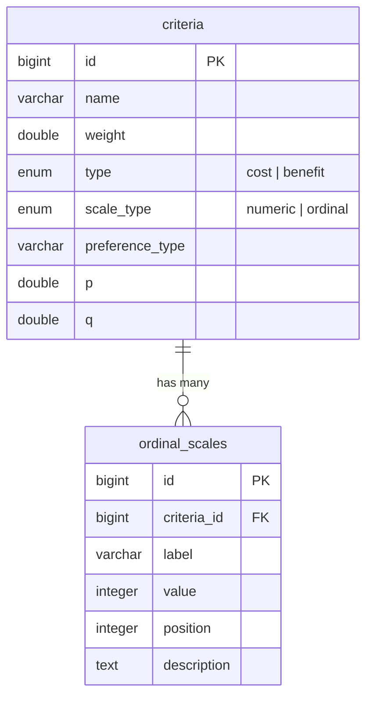

# Criteria dengan Ordinal Scale

## Latar Belakang

Aplikasi FDM Bulungan sudah memiliki tabel `criteria` untuk metode PROMETHEE dengan kolom: `name`, `weight`, `type` (cost/benefit), `preference_type`, `p`, `q`. Saat ini criteria hanya mendukung **nilai numerik kontinu** (misal: tinggi pohon = 15.5 meter).

User ingin menambahkan **Ordinal Scale** — yaitu skala kualitatif yang dikonversi ke nilai numerik untuk perhitungan. Ini penting untuk kriteria yang bersifat kualitatif/kategorikal.

### Daftar Kriteria Aplikasi

| Kriteria | Scale Type | Contoh Input |
|----------|-----------|-------------|
| **Kesehatan** | `ordinal` | Sangat Sehat(5), Sehat(4), Cukup(3), Sakit(2), Kritis(1) |
| **Umur** | `numeric` | Langsung angka: 5, 10, 25 (tahun) |
| **Tinggi** | `numeric` | Langsung angka: 3.5, 12.0 (meter) |
| **Legalitas** | `ordinal` | Dilindungi(3), Semi-Dilindungi(2), Tidak Dilindungi(1) |
| **Lingkar** | `numeric` | Langsung angka: 45, 120 (cm) |
| **Endemik** | `ordinal` | Endemik Lokal(3), Endemik Regional(2), Non-Endemik(1) |
| **Prioritas** | `ordinal` | Sangat Tinggi(5), Tinggi(4), Sedang(3), Rendah(2), Sangat Rendah(1) |
| **Endanger** | `ordinal` | CR(5), EN(4), VU(3), NT(2), LC(1) |

> [!NOTE]
> - **Numeric**: input angka langsung, tidak butuh ordinal scale (Umur, Tinggi, Lingkar)
> - **Ordinal**: input pilihan kualitatif yang di-mapping ke nilai numerik (Kesehatan, Legalitas, Endemik, Prioritas, Endanger)
> - Kedua tipe bisa dicampur dalam satu analisis

## Proposed Schema Design

### Konsep Ordinal Scale

**Ordinal Scale** adalah tingkatan/peringkat kategorikal yang memiliki urutan (order) tapi jarak antar tingkatan tidak harus sama. Dalam konteks decision management:

- Setiap **criteria** bisa memiliki **banyak ordinal scale** (one-to-many)
- Setiap ordinal scale memiliki **label** (deskripsi kualitatif) dan **value** (bobot numerik)
- Value menentukan **urutan/ranking** skala tersebut

### Database Schema

```
criteria (existing, perlu modifikasi)
├── id
├── name
├── weight
├── type (cost/benefit)
├── scale_type (NEW: 'numeric' | 'ordinal')  ← membedakan jenis input
├── preference_type
├── p
├── q
├── created_at
├── updated_at

ordinal_scales (NEW TABLE)
├── id
├── criteria_id (FK → criteria.id)
├── label (varchar) → "Sangat Baik", "Baik", "Cukup", dll
├── value (integer)  → 5, 4, 3, dll (nilai numerik untuk perhitungan)
├── position (integer) → urutan tampil di form (1, 2, 3, ...)
├── description (text, nullable) → penjelasan detail kapan skala ini dipakai
├── created_at
├── updated_at
```

### ERD Relationship



---

## Proposed Changes

### Database Layer

#### [NEW] `database/migrations/xxxx_add_scale_type_to_criteria_table.php`
- Menambahkan kolom `scale_type` ke tabel `criteria` dengan default `'numeric'` agar data lama tetap kompatibel
- Tipe: `enum('numeric', 'ordinal')`

#### [NEW] `database/migrations/xxxx_create_ordinal_scales_table.php`
- Membuat tabel `ordinal_scales` dengan kolom: `id`, `criteria_id`, `label`, `value`, `position`, `description`
- Foreign key `criteria_id` → `criteria.id` dengan `onDelete('cascade')`
- Unique constraint pada `(criteria_id, value)` — satu criteria tidak boleh punya dua skala dengan value yang sama
- Unique constraint pada `(criteria_id, position)` — urutan harus unik per criteria

---

### Model Layer

#### [MODIFY] [Criteria.php](file:///srv/http/fdm-bulungan/app/Models/Criteria.php)
- Tambahkan relationship `ordinalScales()` → `hasMany(OrdinalScale::class)`
- Tambahkan `scale_type` ke fillable
- Tambahkan helper method `isOrdinal(): bool`

#### [NEW] `app/Models/OrdinalScale.php`
- Model baru dengan fillable: `criteria_id`, `label`, `value`, `position`, `description`
- Relationship `criteria()` → `belongsTo(Criteria::class)`

---

### Controller Layer

#### [MODIFY] [CriteriaController.php](file:///srv/http/fdm-bulungan/app/Http/Controllers/Admin/CriteriaController.php)
- Update `store()` — handle penyimpanan ordinal scales saat `scale_type = 'ordinal'`
- Update `update()` — handle sync ordinal scales (delete old, insert new)
- Update `destroy()` — cascade sudah di-handle oleh migration FK
- Gunakan Form Request untuk validasi

#### [NEW] `app/Http/Requests/StoreCriteriaRequest.php`
- Validasi untuk semua field criteria + ordinal scales (conditional: hanya wajib jika `scale_type = 'ordinal'`)

---

### View Layer

#### [MODIFY] [index.blade.php](file:///srv/http/fdm-bulungan/resources/views/admin/criteria/index.blade.php)
- Tambahkan kolom "Skala" di tabel untuk menampilkan badge `Numerik` atau `Ordinal (n skala)`
- Modal form: tambahkan pilihan `scale_type` dan dynamic fieldset untuk input ordinal scales

---

### Factory & Seeder

#### [NEW] `database/factories/CriteriaFactory.php`
- Factory untuk criteria dengan state `numeric()` dan `ordinal()`

#### [NEW] `database/factories/OrdinalScaleFactory.php`
- Factory untuk ordinal scale

#### [NEW] `database/seeders/CriteriaSeeder.php`
- Seeder dengan contoh criteria numerik dan ordinal

---

## Resolved Questions

- ✅ **Criteria campuran** — Ya, dalam satu analisis boleh ada criteria numeric DAN ordinal (contoh: Umur=numeric, Kesehatan=ordinal)
- ✅ **Jumlah skala fleksibel** — Ya, tiap criteria bisa punya jumlah skala berbeda (Endanger=5 skala, Endemik=3 skala)

## Open Questions

> [!IMPORTANT]
> 1. **Lingkar** — Apakah Lingkar (diameter batang) itu numeric (input angka langsung dalam cm) atau ordinal? Saya asumsikan numeric.
>
> 2. **Apakah perlu kolom `description`** di ordinal scale untuk memberi panduan? (misal: "Pilih 'CR' jika populasi tinggal <50 individu di alam")
>
> 3. **Apakah perlu kolom satuan (`unit`)** di criteria numeric? Misal: Umur → "tahun", Tinggi → "meter", Lingkar → "cm"

## Verification Plan

### Automated Tests
- `php artisan test --compact --filter=Criteria` — test CRUD criteria dengan ordinal scale
- Test relationship `Criteria → OrdinalScale` (hasMany/belongsTo)
- Test validasi: ordinal scale wajib jika `scale_type = 'ordinal'`
- Test cascade delete: hapus criteria → ordinal scales ikut terhapus

### Manual Verification
- Buka halaman criteria di browser, buat criteria baru dengan tipe ordinal
- Verifikasi ordinal scales tersimpan dan tampil di tabel
- Edit criteria ordinal, ubah/tambah/hapus skala
- Hapus criteria ordinal, pastikan ordinal scales ikut terhapus
